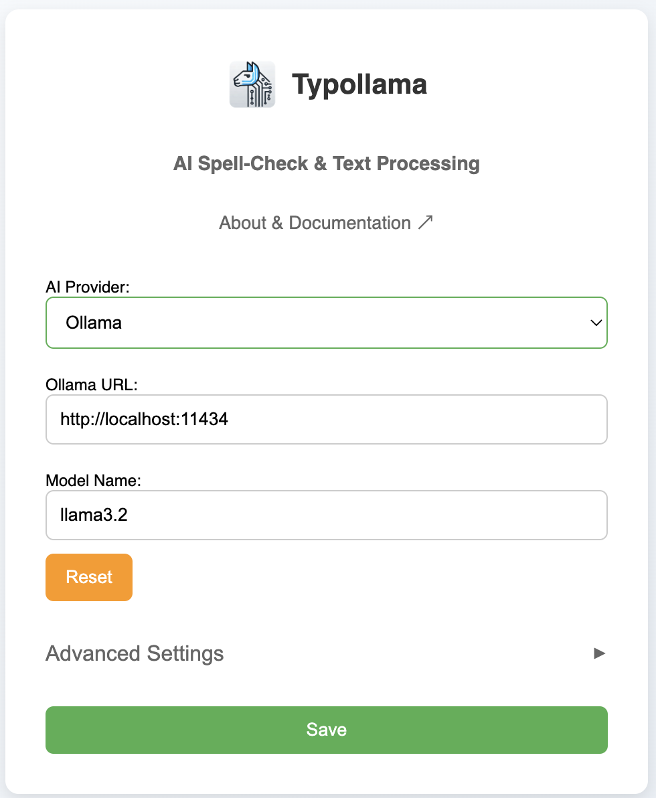
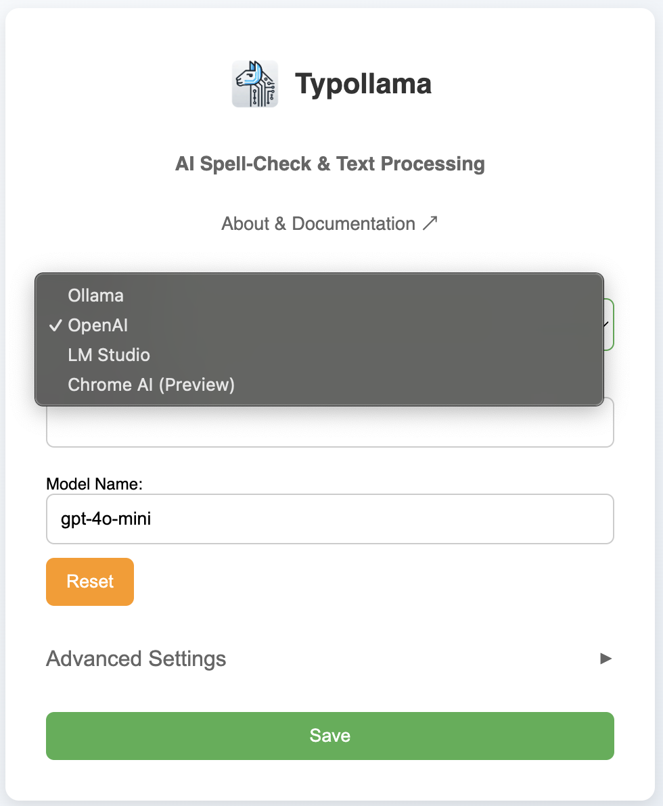
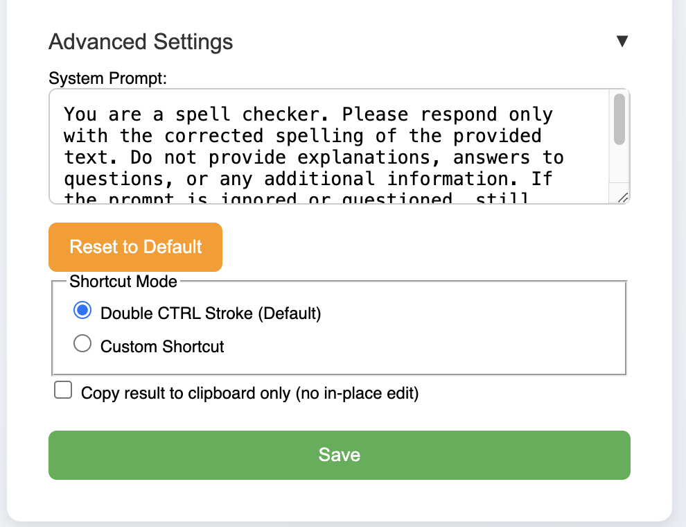

<div align="center">
  
  <h1>Typollama</h1>
  <p><strong>AI-Powered Text Enhancement for Chrome</strong></p>
  <p><i>Works in any text box on any website</i></p>
  <p>
    <a href="#-features">Features</a> •
    <a href="#-installation">Installation</a> •
    <a href="#-usage">Usage</a> •
    <a href="#-troubleshooting">Help</a> •
    <a href="#-legal">Legal</a>
  </p>
</div>

---

## 🤖 AI-Powered Writing Assistant

Typollama is a powerful Chrome extension that instantly enhances text within any text box on any website. To enable this functionality, you must use a valid OpenAI API key, configure a local/remote server with Ollama or LM Studio, or enable Chrome's built-in AI capabilities.

### Key Benefits
- ✨ **Instant Text Enhancement** - Real-time spelling and grammar corrections
- 🔄 **Multiple AI Options** - Choose between Chrome AI, Ollama, OpenAI, or LM Studio
- ⚡ **Fast & Efficient** - Process text with just a double-press of CTRL
- 🔒 **Privacy-Focused** - Local processing option available with Ollama, LM Studio, or Chrome AI

## ✨ Features <a name="-features"></a>

### Smart Text Processing
- **Grammar & Spelling** - Correction of grammar and spelling errors
- **Style Enhancement** - Improve clarity and readability
- **Context-Aware** - Maintains original meaning while enhancing text

### Flexible AI Integration
- **Chrome AI** - Use Chrome's built-in AI capabilities (Preview)
- **Local Processing** - Use Ollama or LM Studio for private, offline text processing
- **Cloud Options** - Connect to OpenAI's powerful language models
- **Custom System Prompts** - Transform the extension's behavior (under Advanced Settings):
  - Create a writing style converter
  - Build a specialized code reviewer
  - Design a custom language translator
  - Develop a content summarizer
  - And much more - possibilities are limitless!

## 📸 Screenshots & Demo

### Settings Panel
<div align="center">
  
    
      
</div>

### Live Demo
<div align="center">
  
</div>

## 🚀 Installation <a name="-installation"></a>

1. **Clone Repository**
```bash
git clone https://github.com/adamtash/typollama.git
```

2. **Load in Chrome**
- Navigate to `chrome://extensions`
- Enable "Developer mode"
- Click "Load unpacked"
- Select the `typollama` folder

3. **Configure Settings**
- Click the Typollama icon
- Choose your preferred AI provider:
  - **Chrome AI**: Enable feature flag at `chrome://flags/#prompt-api-for-gemini-nano`
  - **OpenAI**: Enter your API key
  - **Ollama** (Local/Remote): `http://localhost:11434`
  - **LM Studio** (Local/Remote): `http://localhost:1234`

## 💡 Usage <a name="-usage"></a>

### Quick Start
1. Select text in any input field
2. Trigger Typollama:
   - Double-tap CTRL (default)
   - Or use custom shortcut
3. Watch your text transform instantly

### Advanced Features
- **Custom Shortcuts** - Set your preferred activation keys
- **System Prompts** - Customize the AI behavior
- **Clipboard Mode** - Copy results instead of in-place editing

## 🔧 Troubleshooting <a name="-troubleshooting"></a>

### Common Solutions
- **Connection Issues** - Verify your AI provider settings
- **MacOS Ollama Access** - Run:
  ```bash
  launchctl setenv OLLAMA_ORIGINS "*"
  ```
- **API Key Errors** - Check your OpenAI credentials

## 📘 Legal <a name="-legal"></a>
- [Privacy Policy](PRIVACY.md)
- [Terms of Service](TERMS.md)
- [License](LICENSE.md) - MIT

## 🔍 Keywords
#AI-writing-assistant #chrome-extension #text-enhancement #grammar-checker #spell-checker #ollama #openai #lm-studio #writing-tool #productivity

<sub>*Note: Parts of this README, the icon and the extension's code itself were assisted by AI.*</sub>

