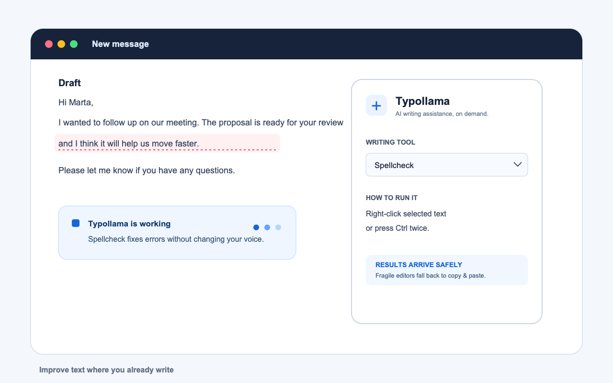
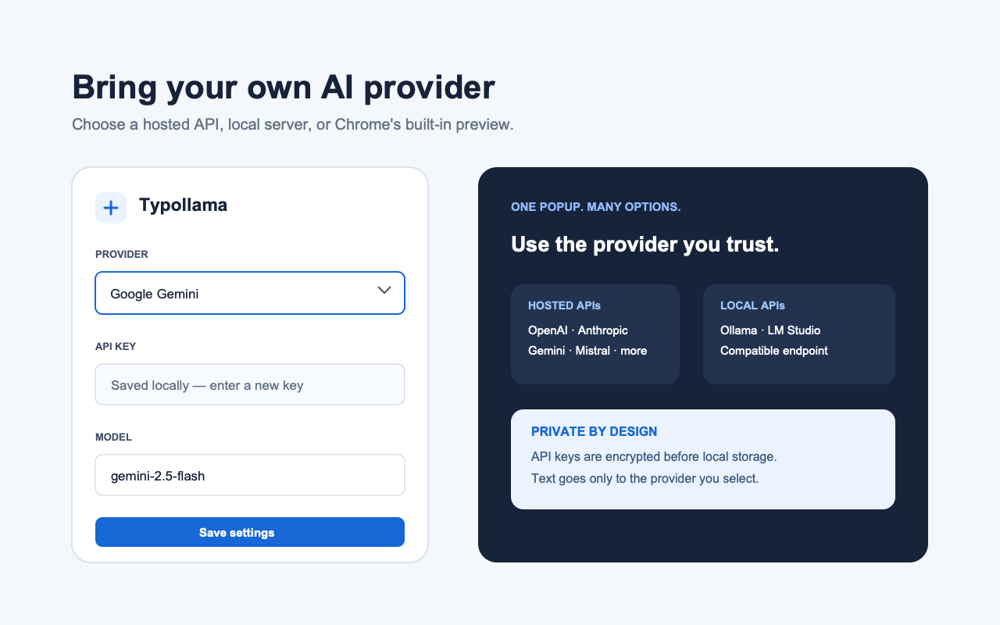
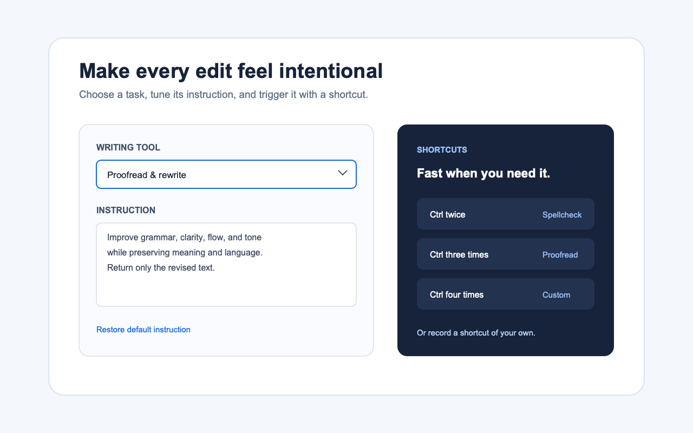

# Typollama

Typollama is a privacy-conscious Chrome extension that improves text directly where you write. Select text—or place the cursor in a text field—then spellcheck, proofread, rewrite, or run a custom writing instruction with the AI provider you choose.

> Your text is processed only after you explicitly invoke a writing tool. Typollama has no account, analytics, or developer-operated text-processing server.



## What it does

- **Spellcheck** fixes spelling and punctuation while preserving wording and formatting.
- **Proofread & rewrite** improves grammar, clarity, flow, and tone while preserving meaning.
- **Custom prompt** lets you define your own editing instruction.
- **Use it your way** with the context menu, Ctrl pressed twice/three/four times, or a recorded shortcut.
- **Protect fragile editors**: when a site cannot safely accept an in-place update, Typollama copies the result so you can paste it yourself.
- **Keep data close** by using Ollama or LM Studio, or choose a hosted provider that you already trust.



## Providers

Typollama uses provider-specific request formats instead of treating every API as interchangeable. Model names remain editable because availability depends on your account and provider.

| Type | Supported providers |
| --- | --- |
| Hosted APIs | OpenAI, Anthropic, Google Gemini, DeepSeek, Mistral AI, Perplexity Sonar, xAI Grok, Cohere |
| OpenAI-compatible APIs | Groq, Together AI, OpenRouter, a user-supplied compatible endpoint |
| Local APIs | Ollama, LM Studio |
| Browser feature | Chrome built-in AI (preview, when available) |

Only the provider you select receives text for that request. A custom compatible endpoint asks for access to that specific origin when you save it.



## Install from source

1. Clone or download this repository.
2. In Chrome, open `chrome://extensions`.
3. Turn on **Developer mode**.
4. Select **Load unpacked** and choose this project folder.
5. Open Typollama, select a provider, add its API key or local server URL, then select **Save settings**.

For hosted providers, create and manage API keys in the provider's own dashboard. For a local setup, start Ollama or LM Studio before invoking a writing tool.

## Use Typollama

1. Click in a text field, or select the portion of an editable message that you want to improve.
2. Choose **Spellcheck with AI**, **Proofread & rewrite with AI**, or **Custom writing tool** from the right-click menu; alternatively, use the configured shortcut.
3. Wait for Typollama to finish streaming the result. It replaces the target text once, after the response is complete.

Some rich-text editors deliberately block programmatic edits. On those sites, Typollama never mutates the editor's DOM; it copies the finished result and tells you to paste it. You can also enable **Copy the result instead of replacing text** globally.

## Privacy and security

- Text is read only from the editor you explicitly target and is used only for the selected writing request.
- With a hosted provider, that text and the request instruction are sent to the provider you selected. With Ollama or LM Studio, requests go to the local server URL you configure.
- Settings are stored in Chrome Sync. API keys are stored in the extension's trusted local storage and encrypted with AES-GCM before storage.
- Typollama does not run analytics, sell data, or send text to a Typollama-operated backend.

Read the full [Privacy Policy](PRIVACY.md) and [Terms of Service](TERMS.md).

## Development

```bash
npm test
npm run check
npm run package
```

`npm run package` validates the project and produces a Chrome Web Store upload archive in `dist/`. See [CHROME_WEB_STORE.md](CHROME_WEB_STORE.md) for exact listing copy, privacy disclosures, screenshots, and the final release checklist.

## License

[MIT](LICENSE.md)
